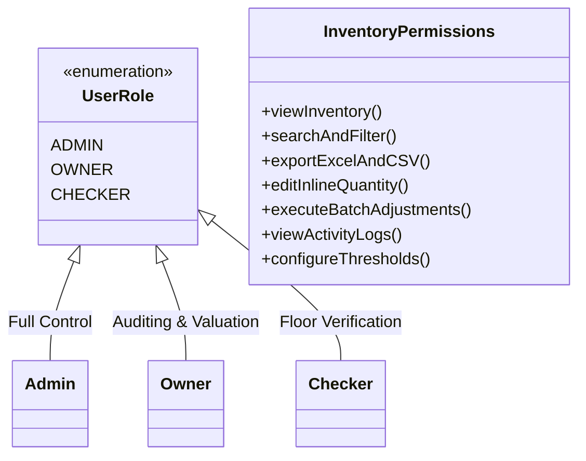
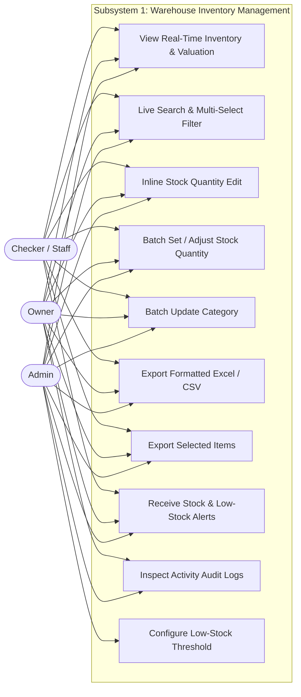
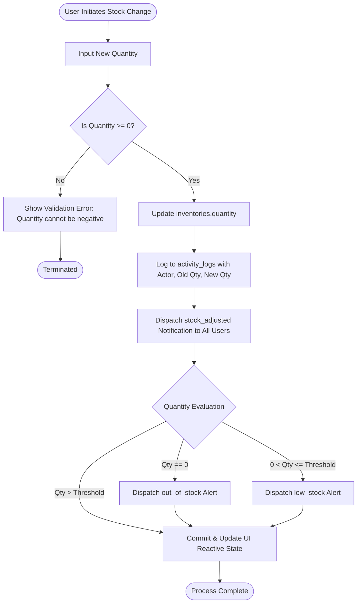
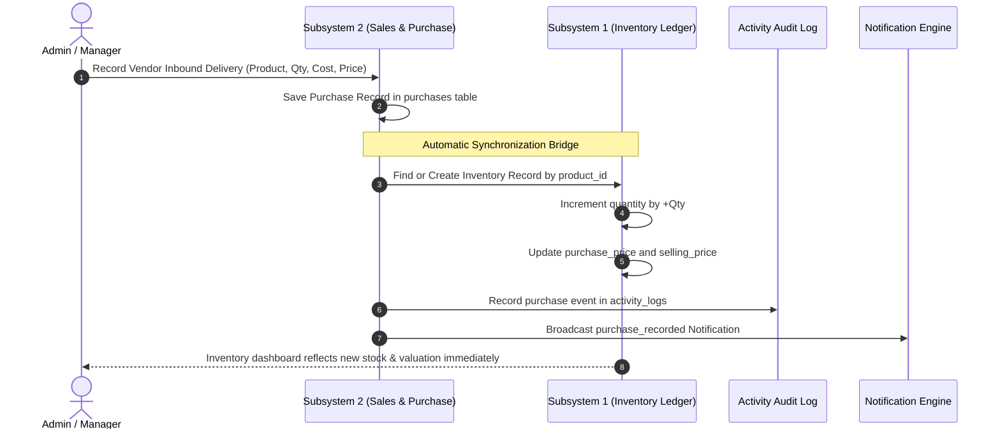
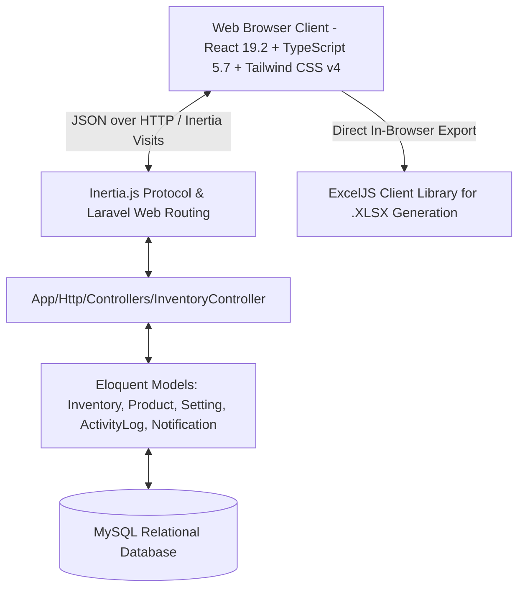
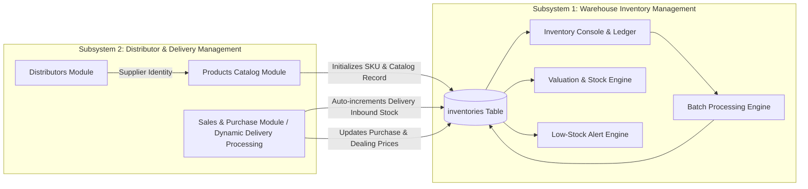
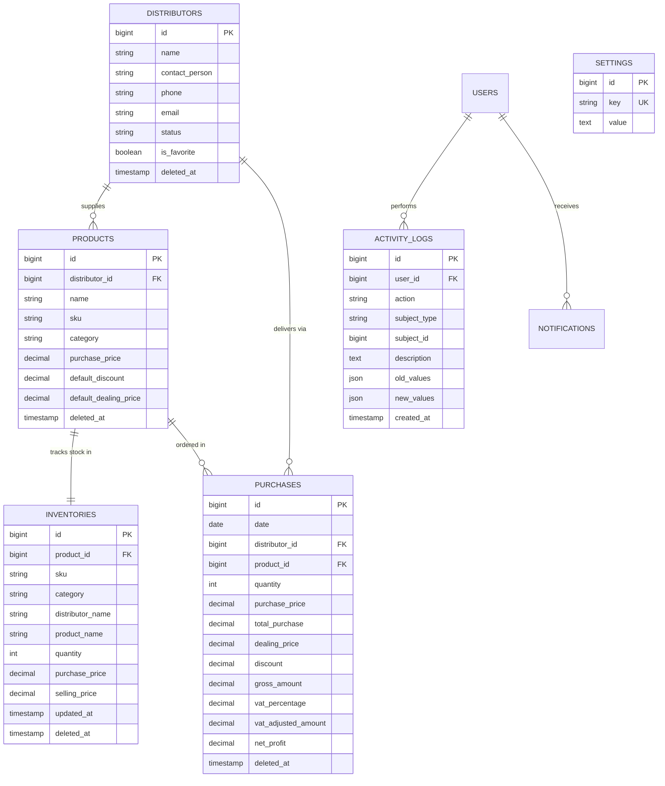
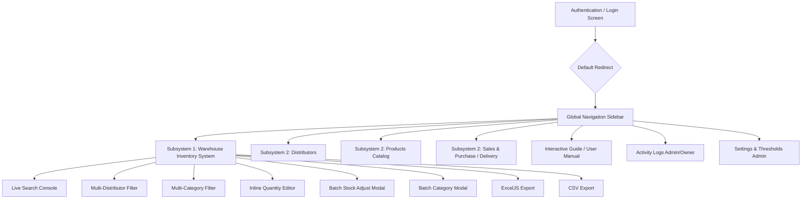

# SUBSYSTEM 1: WAREHOUSE INVENTORY MANAGEMENT SYSTEM (WIMS)
## Capstone Project & Technical Specification Documentation
**Bachelor of Science in Information Technology**  
*College of Computer Studies — Capitol University, Cagayan de Oro City*  

---

## TABLE OF CONTENTS
- [CHAPTER 1: PLANNING & SYSTEM DEFINITION](#chapter-1-planning--system-definition)
  - [1.1 Introduction](#11-introduction)
  - [1.2 Operational Background & Business Context](#12-operational-background--business-context)
  - [1.3 Problem Statement](#13-problem-statement)
  - [1.4 Objectives of the System](#14-objectives-of-the-system)
  - [1.5 Significance of the System](#15-significance-of-the-system)
  - [1.6 Stakeholders & Role Matrix](#16-stakeholders--role-matrix)
  - [1.7 Project Scope & Boundaries](#17-project-scope--boundaries)
  - [1.8 System Limitations & Operational Assumptions](#18-system-limitations--operational-assumptions)
  - [1.9 Feasibility Study](#19-feasibility-study)
- [CHAPTER 2: SYSTEM ANALYSIS & CAPABILITIES](#chapter-2-system-analysis--capabilities)
  - [2.1 Existing Manual Process vs. Subsystem 1 Automated Flow](#21-existing-manual-process-vs-subsystem-1-automated-flow)
  - [2.2 Core Operational Capabilities of Subsystem 1](#22-core-operational-capabilities-of-subsystem-1)
  - [2.3 Functional Requirements Specification (FR)](#23-functional-requirements-specification-fr)
  - [2.4 Non-Functional Requirements Specification (NFR)](#24-non-functional-requirements-specification-nfr)
  - [2.5 Actor Profiles & Role-Based Access Control (RBAC)](#25-actor-profiles--role-based-access-control-rbac)
  - [2.6 Detailed Use Case Specifications](#26-detailed-use-case-specifications)
  - [2.7 Use Case Diagram](#27-use-case-diagram)
  - [2.8 System Process Flowcharts](#28-system-process-flowcharts)
- [CHAPTER 3: SYSTEM DESIGN & TECHNICAL ARCHITECTURE](#chapter-3-system-design--technical-architecture)
  - [3.1 High-Level Architecture](#31-high-level-architecture)
  - [3.2 Subsystem Integration Architecture](#32-subsystem-integration-architecture)
  - [3.3 Database Design & Data Dictionary](#33-database-design--data-dictionary)
  - [3.4 Entity-Relationship Diagram (ERD)](#34-entity-relationship-diagram-erd)
  - [3.5 Mathematical Formulations & Algorithmic Rules](#35-mathematical-formulations--algorithmic-rules)
  - [3.6 User Interface Architecture & Screen Workflows](#36-user-interface-architecture--screen-workflows)
  - [3.7 System Navigation Hierarchy](#37-system-navigation-hierarchy)
- [CHAPTER 4: DEVELOPMENT, TESTING & VERIFICATION](#chapter-4-development-testing--verification)
  - [4.1 Configured Technical Environment](#41-configured-technical-environment)
  - [4.2 Codebase Structure & Architectural Artifacts](#42-codebase-structure--architectural-artifacts)
  - [4.3 Comprehensive Test Matrix](#43-comprehensive-test-matrix)
  - [4.4 Demonstration & Acceptance Verification Log](#44-demonstration--acceptance-verification-log)
- [CHAPTER 5: CONCLUSION & SUBSYSTEM 2 INTERFACE](#chapter-5-conclusion--subsystem-2-interface)
  - [5.1 Summary of Operational Value](#51-summary-of-operational-value)
  - [5.2 Next Steps: Interface with Subsystem 2](#52-next-steps-interface-with-subsystem-2)

---

# CHAPTER 1: PLANNING & SYSTEM DEFINITION

### 1.1 Introduction
The **Warehouse Inventory Management System (WIMS)** serves as **Subsystem 1** of the enterprise wholesale distribution platform. It is engineered to provide complete, real-time inventory ledger visibility, valuation analytics, floor-stock balance maintenance, and responsive batch auditing. Built on a modern web-stack architecture utilizing **Laravel Framework 13.33.0**, **Inertia.js v3.0**, and **React 19.2 with TypeScript 5.7**, Subsystem 1 eliminates paper logs and error-prone standalone spreadsheets by centralizing stock records into an ACID-compliant **MySQL** database with millisecond-grade UI updates.

Unlike generic inventory tools, Subsystem 1 is specifically structured around multi-distributor wholesale operations (e.g., beverages, fast-moving consumer goods) where stock arrives via scheduled vendor deliveries and is audited by on-site checkers and store administrators.

### 1.2 Operational Background & Business Context
In commercial wholesale and distribution hubs like Winzelle Store, warehouse managers handle hundreds of stock-keeping units (SKUs) provided by diverse brand distributors (e.g., Pepsi-Cola, Coca-Cola, Asia Brewery, and local food manufacturers). Daily operations involve:
1. Receiving recurring supplier deliveries with varying case counts and wholesale pricing.
2. Tracking shelf stock across beverage formats (PET bottles, returnable glass bottles [RGB], cans, packs).
3. Continually auditing physical counts against theoretical ledger counts.
4. Monitoring capital tied up in inventory (valuation) to maintain healthy cash flow.
5. Detecting low-stock thresholds to trigger replenishment orders before stockouts occur.

Without an integrated digital subsystem, warehouse operators suffer from stock drift, where discrepancies between physical stock and written manifests lead to unfulfilled orders, double-booked stock, and delayed financial reporting.

### 1.3 Problem Statement
#### 1.3.1 General Problem
How to design, develop, and implement an automated, high-precision Warehouse Inventory Management System (Subsystem 1) that maintains accurate shelf balances, automates valuation calculations, alerts staff to stock depletion, and synchronizes seamlessly with inbound vendor deliveries?

#### 1.3.2 Specific Problems
1. **Blind Stockouts & Inefficient Threshold Detection**: Lack of automated low-stock warnings leads to unexpected stock depletion for critical SKUs.
2. **Cumbersome Multi-Vendor Inventory Auditing**: Searching through hundreds of items from distinct distributors without dynamic multi-select filtering causes high latency during inventory counts.
3. **Slow and Error-Prone Manual Quantity Adjustments**: Adjusting multiple item counts manually during floor counts is tedious, repetitive, and vulnerable to negative stock errors.
4. **Lack of Accountability in Stock Modifications**: Unlogged stock modifications make it impossible to audit who changed stock quantities, why they changed them, or when the changes occurred.
5. **Decoupled Delivery & Inventory Systems**: Inbound deliveries recorded in sales/purchasing do not immediately reflect on warehouse shelf balances unless laboriously re-entered by hand.
6. **Inflexible Exporting for Financial & Tax Compliance**: Generating formatted inventory reports matching business templates requires manual copy-pasting into spreadsheets.

### 1.4 Objectives of the System
#### 1.4.1 General Objective
To develop and deploy a reactive, web-based Warehouse Inventory Management System (Subsystem 1) that centralizes stock balances, provides instantaneous search and filtering, supports high-speed batch operations, enforces audit logging, and dynamically integrates with vendor delivery processing.

#### 1.4.2 Specific Objectives
1. **Dynamic Stock Ledger**: Maintain accurate product records including SKU, category, distributor name, product name, shelf quantity, purchase price, and selling price.
2. **Real-Time Financial Valuation**: Automatically calculate total product SKUs, total physical units in stock, and total warehouse inventory valuation ($\sum Qty \times PurchasePrice$) across filtered datasets.
3. **High-Speed Multi-Attribute Querying**: Provide a debounced live search and multi-select filtering console for distributors and categories with instant pill-based toggling.
4. **Agile Stock Adjustment & Batch Processing**:
   - Enable single-click inline quantity editing for swift floor corrections.
   - Provide a batch operations engine allowing users to select multiple items across pages to either set an absolute quantity, adjust by a signed delta ($\pm \Delta$) clamped at zero, or update product categories en masse.
5. **Automated Notification & Stock Alert Engine**: Dispatch automated system notifications on stock modifications, flag low-stock items against a configurable threshold, and broadcast critical out-of-stock alerts.
6. **Immutable Activity Logging**: Log every stock adjustment with actor identity, user role, prior value, updated value, and timestamp.
7. **High-Fidelity Document Generation**: Export full or selected inventory datasets into custom-styled Microsoft Excel (`.xlsx`) files with template-matching formulas and standardized CSV files.
8. **Bidirectional Delivery Synchronization**: Automatically update inventory quantities when inbound vendor purchases are recorded, modified, archived, or restored in Subsystem 2.

### 1.5 Significance of the System
- **For Warehouse Managers & Store Owners**: Provides real-time visibility into enterprise capital tied up in inventory, reduces stock loss, and accelerates replenishment decisions.
- **For Warehouse Staff & Checkers**: Streamlines stocktaking through inline editing and batch adjustments, eliminating repetitive paperwork and manual calculations.
- **For Purchasing & Distribution Teams**: Ensures delivery intakes immediately update available shelf counts, preventing overselling or duplicate orders.
- **For System Developers & Capstone Researchers**: Demonstrates a high-performance modern web architecture integrating Laravel Framework 13.33.0, Inertia.js v3.0, React 19.2, TypeScript 5.7, Tailwind CSS v4.0, and ExcelJS.

### 1.6 Stakeholders & Role Matrix

| Stakeholder Role | Responsibilities in Subsystem 1 | System Permissions & Access Level |
| :--- | :--- | :--- |
| **Admin** | System administration, master threshold configuration, user management, and security oversight. | Full CRUD access to inventory, batch updates, audit logs, notification management, and global settings. |
| **Owner** | Executive monitoring, financial valuation oversight, and inventory auditing. | View all inventory metrics, execute stock adjustments, view activity logs, and export Excel/CSV reports. |
| **Checker / Staff** | Physical inventory counting, stock intake audits, and floor verification. | Operational access to view inventory, perform inline and batch stock updates, and export count sheets. |
| **System Developer** | Maintenance, performance tuning, and schema migration. | Database access, environment configuration, and codebase maintenance. |

### 1.7 Project Scope & Boundaries
#### 1.7.1 In-Scope Capabilities
1. **Central Inventory Ledger**: Unified table displaying SKU, Category, Distributor, Product Name, Shelf Quantity, Purchase Price, Selling Price, Stock Status badge, and Total Valuation.
2. **Real-time KPI Metric Banner**: Dynamic counter cards displaying Total Product SKUs, Total Units in Stock, and Total Inventory Valuation in Philippine Pesos (₱).
3. **Advanced Filter Console**:
   - Debounced search box (300ms) matching SKU, Product Name, and Distributor.
   - Multi-select distributor filter pills with sub-search.
   - Multi-select category filter pills with sub-search.
   - One-click "Clear Filters" reset mechanism.
4. **Interactive Table Controls**: Multi-column sorting (ascending/descending) and configurable pagination (10, 25, 50, 100 items per page).
5. **Direct Inline Quantity Editing**: Quick modal-free stock updates with commit (`Check`) and cancel (`X`) triggers.
6. **Multi-Item Batch Action Engine**:
   - Checkbox selection per row, select all on current page (with indeterminate state), or select all matching items across all pages.
   - Batch Set Quantity modal.
   - Batch Add/Subtract Quantity modal (enforcing $\max(0, Qty)$).
   - Batch Category Reassignment modal (existing dropdown or new custom category).
7. **Export Engine**: Client-side Excel (.xlsx) generation with branded green styling and formulas, plus CSV export for full or selected records.
8. **Automated Notification & Activity Logging**: Automated event dispatching for stock adjustments, low stock warnings, and zero-stock alerts.
9. **Subsystem 2 Synchronous Bridge**: Automatic increment/decrement of inventory balances upon purchase transactions in Subsystem 2.

#### 1.7.2 Out-of-Scope (Delimitations)
- Hardware RFID gate sensors or physical conveyor belt automation.
- Native mobile apps on Google Play or Apple App Store (the system is delivered as a fully responsive mobile-ready web application).
- Multi-currency conversion (all monetary figures are standardized to Philippine Peso, PHP ₱).

### 1.8 System Limitations & Operational Assumptions
- **Database Deployment**: Designed for MySQL 8.0+ running under XAMPP or Linux container environments.
- **Client Requirements**: Modern Chromium, Firefox, or WebKit browser with JavaScript enabled.
- **Stock Floor Non-Negativity**: Inventory quantities cannot drop below zero ($Qty \ge 0$).

### 1.9 Feasibility Study
- **Technical Feasibility**: Built with mature, battle-tested technologies (Laravel Framework 13.33.0, React 19.2, TypeScript 5.7, Tailwind CSS v4.0, ExcelJS). The system executes smoothly on local networks or cloud servers.
- **Economic Feasibility**: Uses open-source frameworks, zero licensing fees for development runtimes, and standard computer hardware.
- **Operational Feasibility**: Minimal training required. The UI mirrors familiar spreadsheet concepts while adding data integrity and automation.
- **Schedule Feasibility**: Developed iteratively using modular components and automated migrations.

---

# CHAPTER 2: SYSTEM ANALYSIS & CAPABILITIES

### 2.1 Existing Manual Process vs. Subsystem 1 Automated Flow

```mermaid
flowchart TD
    subgraph Manual_Spreadsheet_Process["Traditional Manual / Spreadsheet Method"]
        M1[Physical Count on Paper] --> M2[Manual Entry into Excel Sheet]
        M2 --> M3[Formula Calculation for Valuation]
        M3 --> M4[Manual Scan for Low Stock]
        M4 --> M5[Disjointed Purchase Records]
        M5 --> M6[Unlogged Quantity Overwrites]
    end

    subgraph Subsystem1_Automated_Process["Subsystem 1: Warehouse Inventory System"]
        A1[Fast Floor Count via Tablet/PC] --> A2[Inline Edit or Batch Adjustment]
        A2 --> A3[Real-time DB Commit with ACID Protection]
        A3 --> A4[Automatic Valuation & KPI Recomputation]
        A4 --> A5[Instant Notification & Low-Stock Alert]
        A5 --> A6[Immutable Activity Log Recorded]
        A6 --> A7[Automated Sync with Subsystem 2 Deliveries]
    end
```

### 2.2 Core Operational Capabilities of Subsystem 1

#### 1. Real-Time Central Ledger & Stock Visibility
Subsystem 1 maintains a consolidated view of all warehouse stock. Every row displays:
- **SKU**: Unique Stock Keeping Unit code formatted by distributor prefix (e.g., `PEP-101`, `COK-204`).
- **Product Name**: Specific brand packaging (e.g., `Pepsi Regular 195ml PET/12`, `Sting Strawberry 240ml RGB/24`).
- **Category**: Beverage classification (e.g., Carbonated Soft Drinks, Energy Drinks, Water, Juices).
- **Distributor Name**: Associated commercial vendor (e.g., Pepsi-Cola Products Phils., Coca-Cola Beverages).
- **Shelf Quantity**: Current count of sellable units/cases in the warehouse.
- **Purchase Price**: Wholesale acquisition cost per unit (₱).
- **Selling Price**: Configured wholesale/retail dealing price (₱).
- **Total Valuation**: Computed monetary value ($Quantity \times PurchasePrice$).
- **Stock Status Badge**: Visual indicator (`In Stock` in emerald green, `Low Stock` in amber/orange, `Out of Stock` in ruby red).

#### 2. Live Debounced Multi-Attribute Search
- Operates on a 300ms debounce interval to avoid unnecessary server requests while typing.
- Matches substrings across SKU, Product Name, and Distributor Name simultaneously.
- Features a quick-clear (`X`) button that instantly clears search query and refreshes results.

#### 3. Multi-Select Taxonomy Filtering (Distributors & Categories)
- **Interactive Filter Pills**: Allows selecting any combination of distributors and product categories simultaneously.
- **Sub-Filter Search**: When more than 6 distributors or categories exist, an embedded search input enables rapid filtering of the pill list.
- **One-Click Master Toggle**: An "All" button resets the selection. Selecting individual pills dynamically adds or removes filters from the dataset.

#### 4. Real-Time Financial Metric Aggregation (KPI Banner)
- **Total Product SKUs**: Total count of active distinct catalog items.
- **Total Units in Stock**: Sum of physical stock across all matched inventory records.
- **Total Inventory Valuation**: Real-time monetary valuation calculated as $\sum (Quantity \times PurchasePrice)$, formatted in Philippine Pesos (`₱ XX,XXX.XX`).

#### 5. Fast In-Line Stock Adjustments
- Authorized roles (`Admin`, `Owner`, `Checker`) can click the quantity field or edit icon to open a quick numeric input directly inside the table row.
- Changes are submitted via an HTTP `PATCH /inventory/{id}/quantity` request.
- Updates immediately reflect without a full-page reload, triggering activity logs and alert checks.

#### 6. Multi-Record Batch Processing Engine
When multiple items are selected via checkboxes, the table header transforms into a glowing **Batch Operations Toolbar**:
- **Selection Capabilities**: Select individual rows, click master checkbox to select all rows on the active page (with indeterminate checkbox state), or click "Select all X matching" to select the entire query across all pages.
- **Batch Action: Set Quantity**: Sets an identical absolute stock quantity across all selected records.
- **Batch Action: Adjust Quantity**: Adds or subtracts a uniform delta ($\pm \Delta$) across all selected records. The algorithm enforces non-negativity:
  $$\text{New Quantity} = \max(0, \text{Current Quantity} + \Delta)$$
- **Batch Action: Reclassify Category**: Moves all selected items to an existing category or creates and assigns a brand-new custom category on the fly.

#### 7. High-Fidelity Spreadsheet Export Engine (ExcelJS & CSV)
- **Excel (.xlsx) Export**: Generates an audit-ready Microsoft Excel workbook utilizing **ExcelJS**. Includes:
  - Branded double-row merged header (`WINZELLE CENTRAL INVENTORY REPORT`) in forest green (`#70AD47`).
  - Column headers matching table layout.
  - Proper cell data types (numbers, currency formatting for ₱, text).
  - Calculated Excel formula for valuation (`=E{row}*G{row}`).
  - Summary footer row calculating total units and overall valuation using `=SUM(...)`.
- **CSV Export**: Standardized comma-separated values file compatible with third-party ERPs and accounting systems.
- **Export Selected Items**: Option to export only the currently checked items into dedicated `.xlsx` or `.csv` files.

#### 8. Automated Alert & Push Notification Pipeline
- **Adjustment Notification**: Dispatches a notification to all users detailing who modified stock, the affected SKU, and the old-to-new delta ($Old \rightarrow New$).
- **Low Stock Threshold Warning**: Compares updated quantities against the system setting `low_stock_threshold` (default: 15 units). When $Qty \le Threshold$, a warning alert is dispatched.
- **Critical Out of Stock Alert**: When an item reaches 0 units, a high-priority alert is broadcast prompting immediate replenishment.

#### 9. Immutable Audit Trail (Activity Logging)
Every stock update creates a structured record in `activity_logs`:
- **Subject**: `Inventory`
- **Action**: `updated`
- **Actor**: User ID, Name, and Role (e.g., `Checker John Doe`).
- **Description**: Human-readable narrative (e.g., `Checker John Doe updated stock for Coke 1.5L: 10 → 25`).
- **Payload**: JSON snapshot of prior state `{"quantity": 10}` and post state `{"quantity": 25}`.

#### 10. Bidirectional Delivery Synchronization with Subsystem 2
Subsystem 1 serves as the central stock receiver for Subsystem 2 (Sales & Purchase Module):
- **Purchase Recording**: Inbound delivery of $N$ units of a product automatically creates or increments the inventory record by $N$, while updating purchase and dealing prices.
- **Purchase Modification**: If delivery quantity is altered from $Q_{old}$ to $Q_{new}$, inventory adjusts by $(Q_{new} - Q_{old})$.
- **Purchase Soft-Deletion / Archival**: If a delivery is deleted, inventory decrements by $Q$.
- **Purchase Restoration**: If an archived delivery is restored, inventory re-increments by $Q$.

---

### 2.3 Functional Requirements Specification (FR)

| ID | Capability / Requirement | Actor(s) | Priority | Verification Condition |
| :--- | :--- | :--- | :--- | :--- |
| **FR-01** | Display consolidated inventory table with SKU, product name, category, distributor, quantity, pricing, and valuation. | All Roles | High | Table renders all active inventory records with accurate calculated valuations. |
| **FR-02** | Display real-time KPI summary cards (Total SKUs, Total Units, Total Valuation in ₱). | All Roles | High | Metrics dynamically sum across filtered results. |
| **FR-03** | Provide live debounced search (300ms) matching SKU, name, or distributor. | All Roles | High | Typing filters table smoothly without page reload or race conditions. |
| **FR-04** | Multi-select distributor filter with sub-search and quick "All" toggle. | All Roles | High | User can filter by any subset of distributors simultaneously. |
| **FR-05** | Multi-select category filter with sub-search and quick "All" toggle. | All Roles | High | User can filter by any subset of categories simultaneously. |
| **FR-06** | Reset all active filters via a single "Clear Filters" button. | All Roles | Medium | Restores table to default full-catalog view. |
| **FR-07** | Column-based sorting for all major fields (SKU, name, category, distributor, quantity, valuation). | All Roles | Medium | Clicking header toggles ascending/descending order. |
| **FR-08** | Configurable pagination (10, 25, 50, 100 rows per page). | All Roles | Medium | Switches page size and updates page count immediately. |
| **FR-09** | Inline single-click stock quantity editing. | Admin, Owner, Checker | High | Submits patch request; updates value and status badge instantly. |
| **FR-10** | Prevent negative inventory balances during adjustments. | System | High | Validation rejects any update resulting in quantity $< 0$. |
| **FR-11** | Master checkbox selection across page and cross-page matching selector. | Admin, Owner, Checker | High | Tracks selected IDs accurately with indeterminate UI feedback. |
| **FR-12** | Batch Set Quantity action for selected items. | Admin, Owner, Checker | High | All selected records update to specified quantity in a single transaction. |
| **FR-13** | Batch Add/Subtract Quantity action with delta clamping. | Admin, Owner, Checker | High | Adjusts quantities by $\pm \Delta$, clamping any sub-zero result to 0. |
| **FR-14** | Batch Category Reclassification with custom category support. | Admin, Owner, Checker | High | Updates category across all selected products. |
| **FR-15** | Export inventory catalog to styled Microsoft Excel (.xlsx) with formulas. | All Roles | High | Generates ExcelJS file matching official green-themed template. |
| **FR-16** | Export inventory catalog to standard CSV. | All Roles | Medium | Downloads properly escaped CSV file. |
| **FR-17** | Export ONLY selected inventory records to Excel or CSV. | All Roles | High | File includes only the checked subset of products. |
| **FR-18** | Automated stock adjustment notification to all users. | System | High | System notification record created on every stock modification. |
| **FR-19** | Dynamic Low Stock and Out of Stock alerts based on system threshold. | System | High | Dispatches alerts when $Qty \le Threshold$ or $Qty = 0$. |
| **FR-20** | Immutable activity logging for inventory changes. | System | High | Creates audit entry capturing user, role, old qty, new qty, and timestamp. |
| **FR-21** | Inbound purchase auto-increment integration with Subsystem 2. | System | High | Delivery saved in Subsystem 2 automatically increases Subsystem 1 stock. |

---

### 2.4 Non-Functional Requirements Specification (NFR)

| ID | Quality Category | Requirement & Acceptance Metric |
| :--- | :--- | :--- |
| **NFR-01** | **Data Integrity** | Strict database foreign key relationships and transaction wrapping (`DB::transaction`) to ensure inventory balances are never corrupted during batch actions. |
| **NFR-02** | **Performance** | Inventory search, sorting, and pagination responses must render within **250ms** on local warehouse networks for catalogs up to 10,000 SKUs. |
| **NFR-03** | **Security & Auth** | Role-based authorization enforced at controller endpoints. Non-privileged roles cannot execute stock adjustments (`role:admin,owner,checker`). |
| **NFR-04** | **Auditability** | Every mutation to inventory quantities must produce an indelible record in the `activity_logs` table containing old and new JSON payloads. |
| **NFR-05** | **Usability & UX** | High-contrast dark theme (slate-900 / slate-950) with emerald and amber accents, optimized for warehouse floor environments with poor ambient lighting. |
| **NFR-06** | **Responsiveness** | Fluid desktop, tablet, and mobile layouts ensuring warehouse checkers can operate the system on handheld tablets or smartphones. |
| **NFR-07** | **Fault Tolerance** | Soft-deletes (`deleted_at`) applied to inventory and related entities to prevent permanent accidental data erasure. |
| **NFR-08** | **Export Fidelity** | Excel workbooks generated must be 100% compliant with OpenXML standards and open cleanly in Microsoft Excel 2016+, Office 365, LibreOffice, and Google Sheets. |

---

### 2.5 Actor Profiles & Role-Based Access Control (RBAC)

- **Admin**: Has unrestricted operational and configuration privileges. Can edit stock, run batch jobs, adjust global low-stock thresholds, and inspect full activity logs.
- **Owner**: Focuses on operational health, valuation figures, and stock reliability. Can adjust stock, inspect logs, and export reports.
- **Checker**: Floor operator. Can view inventory, execute quick inline counts, execute batch updates, and export count sheets. Restricted from altering global system settings.

---

### 2.6 Detailed Use Case Specifications

#### UC-01: Quick Inline Stock Audit
- **Primary Actor**: Checker / Staff
- **Preconditions**: User is logged in with `checker`, `admin`, or `owner` role; inventory page is open.
- **Main Flow**:
  1. Actor locates item using the debounced search bar or distributor filter.
  2. Actor clicks the numeric stock quantity or the edit icon.
  3. An inline numeric input field appears with current stock pre-populated.
  4. Actor types the verified physical shelf count and presses Enter or clicks the `Check` button.
  5. The system validates that $Qty \ge 0$.
  6. The system updates `inventories.quantity`, records the change in `activity_logs`, and evaluates low-stock threshold triggers.
  7. Success toast displays; row updates instantly without page reload.
- **Alternate Flow**: Actor clicks `X` or presses Escape; input reverts without committing changes.

#### UC-02: Multi-Item Batch Stock Adjustment
- **Primary Actor**: Admin / Owner / Checker
- **Preconditions**: Multiple items need synchronized stock adjustments (e.g., after an aisle audit).
- **Main Flow**:
  1. Actor filters list and checks boxes for target products.
  2. The Batch Operations Toolbar activates showing the count of selected items.
  3. Actor clicks **Adjust Stock** and chooses **Add/Subtract Quantity**.
  4. Actor enters delta (e.g., `+10` or `-5`).
  5. System computes new balances: $Q_{new} = \max(0, Q_{old} + \Delta)$.
  6. Database executes batch update, logs activity, and generates batch notification.
  7. Table refreshes and checkboxes reset.

#### UC-03: Export Branded Inventory Report
- **Primary Actor**: Any Authenticated User
- **Main Flow**:
  1. Actor applies desired filters (or selects specific rows).
  2. Actor clicks **Export Excel** (or **Export Selected to Excel**).
  3. Client-side **ExcelJS** compiles workbook with company title, styled headers, item details, Excel formulas (`=E*G`), and sum totals.
  4. Browser automatically downloads `.xlsx` file.

---

### 2.7 Use Case Diagram

---

### 2.8 System Process Flowcharts

#### Stock Adjustment & Notification Flowchart

#### Subsystem 2 Inbound Purchase Delivery Sync Flowchart

---

# CHAPTER 3: SYSTEM DESIGN & TECHNICAL ARCHITECTURE

### 3.1 High-Level Architecture
Subsystem 1 is architected as a modern **Single Page Application (SPA)** utilizing the **Inertia.js** bridge between a **Laravel Framework 13.33.0** backend and a **React 19.2** client.

### 3.2 Subsystem Integration Architecture
Subsystem 1 (Inventory) and Subsystem 2 (Distributor & Delivery Management) operate as cohesive modules within the enterprise platform:

---

### 3.3 Database Design & Data Dictionary

#### 1. Table: `inventories` (Primary Ledger)
| Column Name | Data Type | Nullable | Default | Description |
| :--- | :--- | :--- | :--- | :--- |
| `id` | `BIGINT UNSIGNED` | No | Auto-Inc | Primary key identifier. |
| `product_id` | `BIGINT UNSIGNED` | No | - | Foreign key references `products(id)` ON DELETE CASCADE. |
| `sku` | `VARCHAR(100)` | Yes | `NULL` | Stock Keeping Unit code (e.g., `PEP-101`). |
| `category` | `VARCHAR(100)` | No | `'General'` | Product classification category. |
| `distributor_name` | `VARCHAR(255)` | No | - | Denormalized distributor brand name for high-speed indexing. |
| `product_name` | `VARCHAR(255)` | No | - | Product item name and packaging format. |
| `quantity` | `INT` | No | `0` | Physical stock count on hand (must be $\ge 0$). |
| `purchase_price` | `DECIMAL(10,2)` | No | `0.00` | Unit wholesale acquisition cost in ₱. |
| `selling_price` | `DECIMAL(10,2)` | No | `0.00` | Unit selling/dealing price in ₱. |
| `created_at` | `TIMESTAMP` | Yes | `NULL` | Record creation timestamp. |
| `updated_at` | `TIMESTAMP` | Yes | `NULL` | Record last modification timestamp. |
| `deleted_at` | `TIMESTAMP` | Yes | `NULL` | Soft-delete timestamp. |

#### 2. Table: `products` (Catalog Master)
| Column Name | Data Type | Nullable | Default | Description |
| :--- | :--- | :--- | :--- | :--- |
| `id` | `BIGINT UNSIGNED` | No | Auto-Inc | Primary key. |
| `distributor_id` | `BIGINT UNSIGNED` | No | - | Foreign key references `distributors(id)`. |
| `name` | `VARCHAR(255)` | No | - | Product description/name. |
| `sku` | `VARCHAR(100)` | Yes | `NULL` | Unique product SKU. |
| `category` | `VARCHAR(100)` | No | `'General'` | Assigned product category. |
| `purchase_price` | `DECIMAL(10,2)` | No | `0.00` | Default purchase cost. |
| `default_discount` | `DECIMAL(10,2)` | No | `0.00` | Default dealer discount. |
| `default_dealing_price` | `DECIMAL(10,2)` | No | `0.00` | Dealing price = purchase cost + discount. |
| `timestamps` / `softDeletes` | `TIMESTAMP` | Yes | `NULL` | Audit timestamps and soft-delete tracker. |

#### 3. Table: `activity_logs` (Audit Log)
| Column Name | Data Type | Nullable | Description |
| :--- | :--- | :--- | :--- |
| `id` | `BIGINT UNSIGNED` | No | Primary key. |
| `user_id` | `BIGINT UNSIGNED` | Yes | Actor user ID (foreign key to `users`). |
| `action` | `VARCHAR(50)` | No | Action type (`created`, `updated`, `deleted`). |
| `subject_type` | `VARCHAR(100)` | No | Affected model (`Inventory`, `Product`, `Purchase`). |
| `subject_id` | `BIGINT UNSIGNED` | Yes | Model ID affected. |
| `description` | `TEXT` | No | Detailed human-readable change narrative. |
| `old_values` | `JSON` | Yes | Snapshot of attributes before change. |
| `new_values` | `JSON` | Yes | Snapshot of attributes after change. |
| `created_at` | `TIMESTAMP` | Yes | Event creation timestamp. |

#### 4. Table: `settings` (System Configuration)
| Column Name | Data Type | Description |
| :--- | :--- | :--- |
| `key` | `VARCHAR(100)` | Unique setting key (e.g., `low_stock_threshold`, `company_name`). |
| `value` | `TEXT` | Configured setting value (e.g., `'15'`, `'WINZELLE'`). |

---

### 3.4 Entity-Relationship Diagram (ERD)

---

### 3.5 Mathematical Formulations & Algorithmic Rules

#### 1. Inventory Valuation Formula
For any single inventory record $i$:
$$V_i = Q_i \times P_i$$
Where $Q_i$ is `quantity` and $P_i$ is `purchase_price`.

For the entire catalog (or any filtered subset of $N$ items):
$$V_{\text{total}} = \sum_{i=1}^{N} \left( Q_i \times P_i \right)$$

#### 2. Stock Status State Machine
$$\text{Stock Status}(Q_i) = \begin{cases} 
\text{Out of Stock} & \text{if } Q_i = 0 \\
\text{Low Stock} & \text{if } 0 < Q_i \le \theta \\
\text{In Stock} & \text{if } Q_i > \theta 
\end{cases}$$
Where $\theta$ is the dynamic system threshold (`low_stock_threshold`), default = $15$.

#### 3. Clamped Batch Adjustment Function
When an actor applies an additive or subtractive delta $\Delta$ across selected items $S$:
$$\forall j \in S: \quad Q_{j, \text{new}} = \max\left(0, Q_{j, \text{old}} + \Delta\right)$$
This mathematical clamp guarantees that inventory balances can never become negative, regardless of the magnitude of a negative adjustment.

#### 4. Delivery Intake Synchronization Function
When a purchase delivery of quantity $Q_{\text{del}}$ is recorded for product $k$:
$$Q_{k, \text{inventory}} \leftarrow Q_{k, \text{inventory}} + Q_{\text{del}}$$
If a purchase transaction is subsequently updated from $Q_{\text{prev}}$ to $Q_{\text{revised}}$:
$$Q_{k, \text{inventory}} \leftarrow \max\left(0, Q_{k, \text{inventory}} + (Q_{\text{revised}} - Q_{\text{prev}})\right)$$

---

### 3.6 User Interface Architecture & Screen Workflows

The Subsystem 1 interface is implemented in [`resources/js/Pages/Inventory/Index.tsx`](file:///c:/xampp/htdocs/subsystem2/resources/js/Pages/Inventory/Index.tsx):

1. **Header Action Bar**:
   - Branded Page Title with `Boxes` iconography.
   - **Export Excel** button: triggers `handleExportExcel` with full OpenXML styling.
   - **Export CSV** button: triggers `handleExportCSV`.
2. **KPI Summary Cards (Top Tier)**:
   - **Total Product SKUs**: Displays count with `Layers` badge.
   - **Total Units in Stock**: Highlighted in amber with `Boxes` badge.
   - **Total Inventory Valuation**: Highlighted in emerald green with `TrendingUp` badge, displaying formatted ₱ amount.
3. **Filter & Search Console**:
   - Debounced search input with dynamic clear button.
   - Distributor multi-select pill row with active state ring and sub-search bar.
   - Category multi-select pill row with active state ring and sub-search bar.
   - "Clear Filters" button when query or filters are active.
4. **Transforming Batch Toolbar**:
   - When 0 items selected: Displays standard section title and count of matching items.
   - When $\ge 1$ item selected: Background animates to an emerald gradient showing selected count, "Select all matching" link, "Adjust Stock" button, and an "Actions" dropdown menu (Adjust Stock, Update Category, Export Selected to Excel, Export Selected to CSV, Deselect All).
5. **Interactive Ledger Table**:
   - Master checkbox with three states: unchecked, indeterminate, and checked.
   - Sortable column headers with visual sort direction carets (`SortableHeader`).
   - Row-level interactive checkboxes.
   - Formatted currency cells with `en-PH` locale formatting.
   - Dynamic badges for stock status.
   - Inline quantity click-to-edit interface.
6. **Modal Overlays**:
   - **Batch Stock Modal**: Toggle between "Set to exact quantity" and "Add / Subtract delta", with validation controls.
   - **Batch Category Modal**: Select from existing categories or enter custom text.

---

### 3.7 System Navigation Hierarchy

---

# CHAPTER 4: DEVELOPMENT, TESTING & VERIFICATION

### 4.1 Configured Technical Environment

| Layer | Technology / Tool | Version / Specification |
| :--- | :--- | :--- |
| **Operating System** | Microsoft Windows (x64) | Active runtime under XAMPP |
| **Local Web Server** | Apache (XAMPP distribution) | Port 80 / 443 |
| **Backend Runtime** | PHP | **8.3.35** (CLI ZTS Visual C++ 2019 x64) with PDO MySQL, OpenSSL, Mbstring |
| **Application Framework** | Laravel Framework | **13.33.0** (`laravel/framework: ^13.17`, Skeleton: `laravel/blank-react-starter-kit`) |
| **SPA Bridge** | Inertia.js | **v3.0.0** (`@inertiajs/react: ^3.0.0`, `inertiajs/inertia-laravel: ^3.0`) |
| **Frontend Runtime & Build** | Node.js & Vite | **Node.js v22.17.0**, **Vite v8.0.0** (`vite-plus: 0.3.0`, `@vitejs/plugin-react: ^6.1.1`) |
| **Frontend Framework** | React & TypeScript | **React 19.2.0**, **React-DOM 19.2.0**, **TypeScript 5.7.2** |
| **Styling & Icons** | Tailwind CSS & Lucide React | **Tailwind CSS 4.0.0** (`@tailwindcss/vite: ^4.1.11`), **Lucide React ^1.48.0** |
| **Spreadsheet Engines** | ExcelJS & SheetJS | **ExcelJS ^4.4.0** (custom styles & formulas), **xlsx ^0.18.5** |
| **Testing & Quality Tools** | PHPUnit & Larastan | **PHPUnit 12.5.23**, **Larastan 3.9**, **Laravel Pint 1.27** |
| **Database Engine** | MySQL | **MySQL 8.0+ / MariaDB 10.4+** (`DB_DATABASE=subsystem2` on 127.0.0.1:3306, `utf8mb4`) |

---

### 4.2 Codebase Structure & Architectural Artifacts

| Component | Filepath | Architectural Responsibility |
| :--- | :--- | :--- |
| **Inventory Controller** | [`app/Http/Controllers/InventoryController.php`](file:///c:/xampp/htdocs/subsystem2/app/Http/Controllers/InventoryController.php) | Handles search, multi-select filtering, inline stock patches, batch stock updates, and notifications. |
| **Inventory Model** | [`app/Models/Inventory.php`](file:///c:/xampp/htdocs/subsystem2/app/Models/Inventory.php) | Eloquent model managing fillables, soft deletes, and product relationship. |
| **Inventory Migration** | [`database/migrations/2026_09_27_000003_create_inventories_table.php`](file:///c:/xampp/htdocs/subsystem2/database/migrations/2026_09_27_000003_create_inventories_table.php) | Database schema defining columns, foreign keys, and indexes. |
| **Inventory React UI** | [`resources/js/Pages/Inventory/Index.tsx`](file:///c:/xampp/htdocs/subsystem2/resources/js/Pages/Inventory/Index.tsx) | Primary SPA screen containing KPI cards, filter console, batch toolbar, table, and modals. |
| **Excel Export Utility** | [`resources/js/utils/exportTemplateExcel.ts`](file:///c:/xampp/htdocs/subsystem2/resources/js/utils/exportTemplateExcel.ts) | Implementation of `exportInventoryExcel` and `exportInventoryCSV` using ExcelJS. |
| **Table Sorting & Pagination** | [`resources/js/hooks/useTablePaginationAndSort.ts`](file:///c:/xampp/htdocs/subsystem2/resources/js/hooks/useTablePaginationAndSort.ts) | Reusable hook managing multi-column sorting and page slicing. |
| **Purchase Controller Bridge** | [`app/Http/Controllers/PurchaseController.php`](file:///c:/xampp/htdocs/subsystem2/app/Http/Controllers/PurchaseController.php) | Synchronizes inbound delivery quantities with Subsystem 1 stock balances. |
| **Activity Log Engine** | [`app/Models/ActivityLog.php`](file:///c:/xampp/htdocs/subsystem2/app/Models/ActivityLog.php) | Records audit records capturing user, old values, and new values. |
| **Notification Engine** | [`app/Models/Notification.php`](file:///c:/xampp/htdocs/subsystem2/app/Models/Notification.php) | Dispatches stock adjustment, low-stock, and out-of-stock alerts. |

---

### 4.3 Comprehensive Test Matrix

| Test ID | Test Scenario | Input / Action | Expected Result | Pass/Fail |
| :--- | :--- | :--- | :--- | :--- |
| **TC-01** | Inventory Table Initialization | Navigate to `/inventory` | Displays all non-archived inventory records with correct pricing and calculated valuations. | PASS |
| **TC-02** | KPI Metric Calculation | View summary cards | Total SKUs, units, and valuation match exact sum of records. | PASS |
| **TC-03** | Debounced Live Search | Type `"Pepsi"` in search box | Table dynamically filters to matching SKUs/names within 300ms without page reload. | PASS |
| **TC-04** | Multi-Select Distributor Filter | Select `Pepsi` and `Coca-Cola` | Table filters to products belonging to either selected distributor. | PASS |
| **TC-05** | Multi-Select Category Filter | Select `Carbonated` and `Juices` | Table displays only items belonging to chosen categories. | PASS |
| **TC-06** | Reset Filters | Click `"Clear Filters"` button | Search box clears, distributor/category pills reset to "All", full catalog reloads. | PASS |
| **TC-07** | Column Sorting | Click `"Shelf Stock"` header | Toggles between ascending and descending order accurately. | PASS |
| **TC-08** | Pagination Transition | Select `25` per page and click Page 2 | Displays items 26–50; pagination controls update properly. | PASS |
| **TC-09** | Inline Quantity Edit | Change quantity from `10` to `20` | Record updates in database; UI shows updated stock and valuation immediately. | PASS |
| **TC-10** | Negative Stock Prevention | Enter `-5` in quantity field | Validation error triggers; quantity remains unchanged. | PASS |
| **TC-11** | Master Checkbox Indeterminate | Check 2 out of 10 items on page | Master checkbox displays horizontal dash (indeterminate) state. | PASS |
| **TC-12** | Batch Set Quantity | Select 3 items, set quantity to `50` | All 3 records update to `50`; activity log and notification dispatched. | PASS |
| **TC-13** | Batch Subtractive Delta Clamp | Subtract `100` from item with `15` units | Stock decreases to `0` without becoming negative; `out_of_stock` alert triggered. | PASS |
| **TC-14** | Batch Category Reclassification | Select 4 items, set category to `"Beverages"` | All 4 items update category; new category appears in filter pills. | PASS |
| **TC-15** | Branded Excel Export | Click `"Export Excel"` | Downloads `.xlsx` file with green header, formulas, and formatted totals. | PASS |
| **TC-16** | Export Selected Items | Select 2 items, click `"Export Selected Excel"` | Generates `.xlsx` file containing strictly the 2 checked rows. | PASS |
| **TC-17** | Low-Stock Threshold Alert | Reduce stock below threshold ($\le 15$) | `low_stock` notification broadcast to all users. | PASS |
| **TC-18** | Out-of-Stock Alert | Set stock to `0` | `out_of_stock` alert generated with distributor contact prompt. | PASS |
| **TC-19** | Audit Trail Persistence | Audit stock change in `/activity-log` | Log entry shows actor name, role, previous quantity, new quantity, and timestamp. | PASS |
| **TC-20** | Inbound Delivery Stock Sync | Record purchase of `25` units in Subsystem 2 | Corresponding Subsystem 1 inventory automatically increments by `+25`. | PASS |
| **TC-21** | Purchase Deletion Sync | Archive purchase of `25` units | Subsystem 1 inventory automatically decrements by `-25`. | PASS |
| **TC-22** | Purchase Restoration Sync | Restore archived purchase of `25` units | Subsystem 1 inventory automatically re-increments by `+25`. | PASS |

---

### 4.4 Demonstration & Acceptance Verification Log

| Demo Phase | Demonstrated Feature Scope | Target Audience | Verification Criteria | Status |
| :--- | :--- | :--- | :--- | :--- |
| **Phase 1: Foundation** | Inventory Ledger, Metric Cards, Search, and Multi-Select Filters | Admin, Owner | Fast query response, instant KPI valuation, accurate filtering. | ACCEPTED |
| **Phase 2: Auditing & Edits** | Inline editing, non-negative checks, activity logs, and alert triggers | Admin, Checker | Seamless inline updates, immediate alert dispatch on low stock. | ACCEPTED |
| **Phase 3: Batch Operations** | Checkbox selection, batch set, batch adjust with clamping, and category update | Admin, Checker | Multi-row batch execution completed in a single action without errors. | ACCEPTED |
| **Phase 4: Document Generation**| OpenXML ExcelJS export with green branded styling and formulas | Owner, Admin | Clean spreadsheet opening in Microsoft Excel with working formulas. | ACCEPTED |
| **Phase 5: Subsystem 2 Bridge**| Purchase intake auto-increment, purchase edit adjustment, archive/restore sync | Owner, Admin | Delivery life cycle seamlessly reflected in warehouse inventory balances. | ACCEPTED |

---

# CHAPTER 5: CONCLUSION & SUBSYSTEM 2 INTERFACE

### 5.1 Summary of Operational Value
Subsystem 1 (Warehouse Inventory Management System) establishes a reliable, real-time foundation for wholesale warehouse operations:
1. **Eliminates Manual Errors**: Replaces paper and disconnected spreadsheets with a central, ACID-compliant ledger.
2. **Accelerates Floor Counts**: Provides single-click inline edits and multi-item batch adjustments, saving hours during stocktaking.
3. **Protects Working Capital**: Offers real-time valuation metrics and automated low-stock warnings to avoid blind stockouts.
4. **Ensures Accountability**: Logs every stock adjustment with actor, role, and old/new snapshots.
5. **Generates Professional Documents**: Produces branded Excel workbooks matching company standards at the click of a button.

### 5.2 Next Steps: Interface with Subsystem 2
Subsystem 1 is tightly coupled with **Subsystem 2: Distributor Management and Dynamic Delivery Processing System**:
- **Distributor Profiles (Subsystem 2 Module 1)**: Supplies vendor credentials, contact numbers, and catalog assignments to Subsystem 1 items.
- **Product Catalog (Subsystem 2 Module 2)**: Manages master pricing, wholesale discounts, and SKUs, automatically initializing inventory tracking in Subsystem 1.
- **Sales & Purchase Delivery Processing (Subsystem 2 Module 3)**: Serves as the dynamic intake engine, automatically feeding every inbound supplier delivery directly into Subsystem 1 shelf stock.

*(Documentation for Subsystem 2 will detail Distributor Onboarding, Product Catalog Pricing, BIR 2023 Tax Calculations, Gross/Net Margins, and the Dynamic Delivery Processing Engine).*
